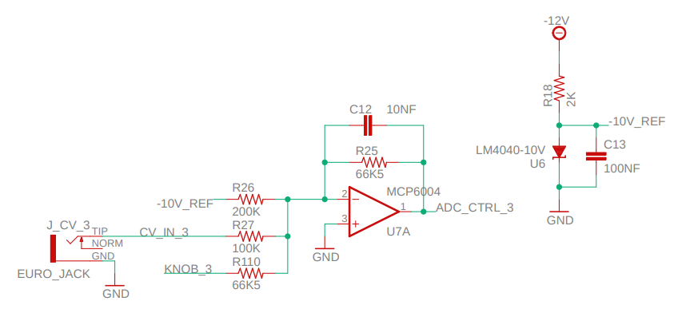
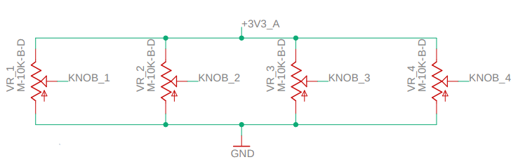
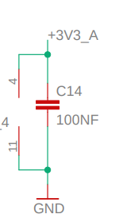
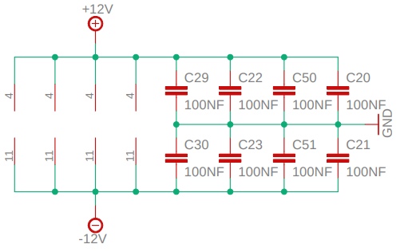
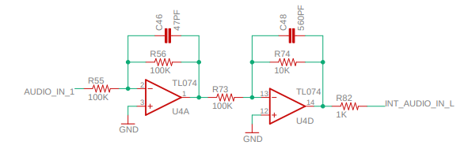
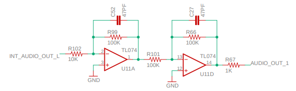
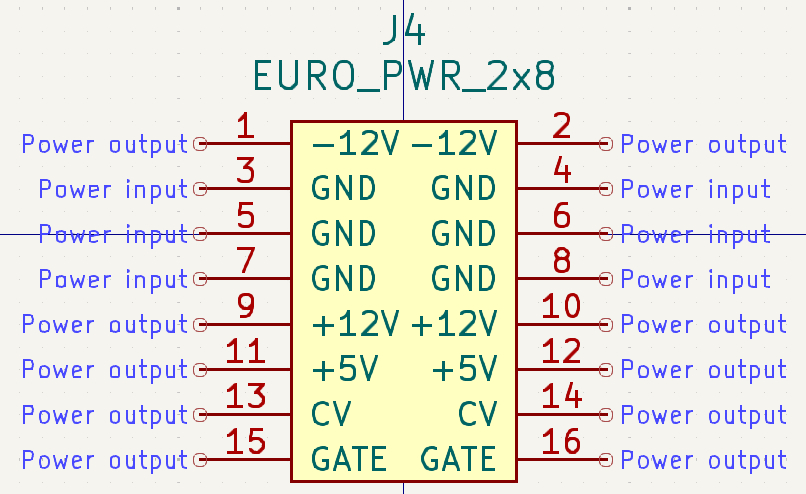
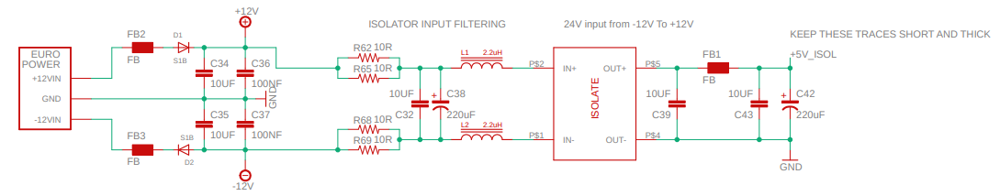

To put together the schematic for the Daisy Delay, I studied the schematics of the [Daisy Patch](https://daisy.nyc3.cdn.digitaloceanspaces.com/products/patch/ES_Daisy_Patch_Rev4.pdf) which contains most of what we need to know.

https://daisy.nyc3.cdn.digitaloceanspaces.com/products/patch-sm/ES_Daisy_Patch_SM_Schematic.pdf

# Switch and LED

The [datasheet PDF](https://daisy.nyc3.cdn.digitaloceanspaces.com/products/seed/Daisy_Seed_datasheet.pdf) has some

GPIO

`Pin Functions - Table 2`

# Eurorack 'conditioning'
There are three

1. ADC Inputs

2. Audio I/O
- attentuating a Eurorack level audio signal to line level on the way in
- boosts the line level signal to Eurorack level on the way out

3. Power
- deriving an isolated +5V from the Eurorack +-12V rails

# 1. ADC Inputs

For each of the two parameters in our Daisy Delay ('delay time' and 'feedback'), we need to:
    a. Sum the CV input voltage (coming in at the jack) with that of the potentiometer
    b. Scale the summed signal so that it falls within the range the Seed ADC pins expect (0-3.3V)

Here is the schematic for the circuit:

## The Input Signals

Let's start with the CV input voltage (CV_IN_3). According to Eurorack standards this will fall within the +-5V range. It is followed by a 100K resistor.

Now let's consider the potentiometer (KNOB_3). We can see from another part of the schematic (below) that KNOB_3 is:
- a 10K potentimeter
- one side is connected to the `3.3V Analog` output pin of the Daisy Seed
- the other side is connected to ground
- the middle 'wiper' terminal comes into our circuit above

Connected in this way, the potentiometer creates a voltage divider circuit, where at one extreme of it's range, the output voltage on the wiper terminal will be close to 0V and at the other extreme it will be close to 3.3V. The chosen resistance value (in this case 10K) will affect the range, sensitivity, and resolution of the output voltage.

So our KNOB_3 signal will fall within the 0-3.3V range. We can also see that it is followed by a 66.5K resistor.

Finally we have our -10V reference. On the right side of the first image above, we can see another schematic. This shows:
- our -12V coming in (from the Eurorack -12V rail)
- a 200K resistor placed in series with it
- then we [LM4040 Shunt Voltage Reference](https://www.ti.com/lit/ds/symlink/lm4040.pdf) whose purpose is to provide a stable and precise -10V output
- this is placed in parallel with a 100NF capacitor, to ensure a clean and stable output voltage under varying operating conditions
- both of which are connected to ground

Back on the left side, we can see that our -10V reference voltage is followed by a 200K resistor

## The Op Amp

We can see that our op amp is connected as follows:
- The negative input (known as the inverting input) is connected in parallel to a 10NF capacitor and a 66.5K resistor
    - These two components are also also both connected to the output of the op amp
    - This is also the output of our circuit (ADC_CTRL_3), which is connected to a Daisy Seed ADC Input pin
- The positive input (known as the non-inverting input) is connected to ground.

As we can see in the extra part of the schematic below, the op amp is powered by the same Daisy Seed pin that powers our potentiometers (the 3.3V Analog pin).

This is an integrator circuit

`
The inverting amplifier can be extended by adding more input sockets (J1) and corresponding input resistors (R1). The right terminals of all input resistors are connected to the inverting input (-) of the operational amplifier O1. The relation between the corresponding input resistor R1 and R2 (the same for all inputs) defines the sensitivity of the input in question. If all resistors have the same value (e.g. 100 kOhm) the amplification is "1" for all inputs. Lowering R1 (e.g. 47k or 22k) increases the sensitivity of the input in question. Increasing R2 (e.g. 220k or 1M) increases the amplification resp. sensitivity for all inputs simultaneously.
`

weighted summing amplifier

[https://www.doepfer.de/DIY/a100_diy.htm]

Q: will the signal be "uninverted" in code 

We can note that:
-10V reference 200K
+-5V CV input 100K
0-3.3V potentiometer 66.5K
right side 66.5K

Q: what is the purpose of the -10V reference voltage? the -10V reference biases or shifts the level downwards

# 2. Audio I/O

Here we are using op amps again - in this case quad op amps in the form of the TL074. Let's begin this time by seeing how they are powered:

Here we can see that the op amp chips are powered directly from the eurorack +12V and -12V rails. For each quad op amp we use two 100NF capacitors to bridge across the + and - terminals to ground. This is to remove noise and/or smooth out any fluctuations in power.

Now let's look at our Audio In and Audio Out circuits next to each other:

Comparing them, we can see that:
- all the op amps are configured to operate as 'inverting' op amps i.e. the polarity between input and output is reversed
- both have a 1K resistor as the last element in the chain
- both have two op amp 'stages', including one with no amplification or attenution (100K resistor on left and right)
    - this is used to counteract the 'inverting' nature of the other op amp in the circuit
- the audio in circuit attenuates using the 2nd op amp (by having a 100K resistor on left, 10K resistor on right)
- the audio out circuit amplifies using the 1st op amp (by having a 10K resistor on left, 100K resistor on right)

Questions:
- Why always a 1K resistor at the end? Does the load have to be less?
- Why use inverting amplifiers at all?
- Why are TL074's used here with audio and MCP6004's when working with ADCs? They are both quad op amps. Answerish here: https://modwiggler.com/forum/viewtopic.php?t=193048

# 3. Power

We need +5V to power our Daisy Seed, the question is where it get it from? There are two options here:
1. Use the dedicated +5V rail (if we have it, most but not all power supplies do)
2. Derive our +5V from the +12V rail (e.g. with a regulator)

Commercial designs follow the second option to ensure ultimate compatability, but we don't have that concern (yet). The question is more, do all the power supplies we are likely to use have the +5V rail? The answer luckily is yes, in our case:
- the [TipTop µZeus](https://schneidersladen.de/de/tiptop-audio-uzeus-modul-mit-flying-bus-boards) does
- so too does our [USB Powerthingies](https://docs.google.com/document/d/1JAcD3iRaLf3Jpy0aVLl79c0GiPyVQEmC2FkkPij2Vjg/edit) by [Timo Rozendal](https://www.timorozendal.nl/)

Another aspect to take into account is that we need to use the larger 16-pin eurorack power connector when connecting our modules, which will take up more space on the PCB and will require a corresponding cable (do we have one?). Previously I have used the [eurocad](https://github.com/nebs/eurocad) library which contains a schematic component for a Eurorack 2x5 pin power header. Unfortunately, it did not contain one for the 2x8 pin version, so I decided to make my own, following the pinouts shown here:

To do this I used KiCad's symbol editor, found my EURO_PWR_2x5 symbol, right clicked it and chose `Derive from Existing Symbol`, then expanded the box size and copied in 6 more pins. In producing the symbol, I noticed two issues with the 

1. the pins for the EURO_PWR_2x5 did not correspond to the ones on the above diagram
    - for example pins 1 and 2 referenced the +12V rail not -12V!
    - this isn't an issue as long as I am shrouding the right way around in the footprint i.e.

Typically in Eurorack the we have a red stripe that represents the -12V rail and we use a shrouded connector to ensure the cable isn't inserted the wrong way around.

https://noiseengineering.us/blogs/loquelic-literitas-the-blog/how-to-plug-in-a-module

2. I also saw that all pins were marked 'power output' and have adapted my version to differentiate between 'power input' and 'power output' pins. My finished 16-pin connector symbol looks like this:

## Deriving +5V from the +12v rail

If we did want to convert from +12V to +5V, we can look at how it was done in the Daisy Patch:

https://forum.kicad.info/t/please-explain-electrical-type-when-create-new-ic-pin/742/3

- The hoopy schematic symbols with two horizontal lines on top are iron core inductors
- The biggest point of confusion is the red 'isolate' box. What it is?

## Other power considerations

### Seed AGND to DGND

Note: For all applications, AGND must be connected to DGND!

### Capacitors

We can bridge capacitors from the power rails to ground, to help smooth out voltage fluctutions, maintain stability and eliminate interference. This is still a bit mysterious to me, but I did the following:

- For the +12V and -12V rails I placed 10uF and 100nF capacitors in parallel between the rail and ground, just as in the Daisy Patch power schematic above
- For the +5V rail I wasn't sure what is best practice, but again took from the above schematic after the 5V has been isolated, by placing 10uF (ceramic) and 220uF (electolytic) capacitors in parallel between the 5V rail and ground

### Ferrite beads

Supress high frequency noise
Should i use them?

# Things I learned along the way:

- how to protect the module from overvoltage and inserting the 10-pin cable the wrong way around (reverse polarity protection). Q: how is overvoltage handled actually?

- how to power the daisy seed using Eurorack +-12V by converting it to +-5V

- how small value capacitors are used between +12V and -12V and GND at each stage of our circuit to reduce noise e.g.
    - directly as the +-12V comes in from our Eurorack power supply
    - again when the +12V is used at the ADC Input stage
    - again when the +12V and +3.3V_A is used at our Audio In/Out stage
    - ???Why is a capacitor placed in parallel with resistor over input/output of op amp?

- how to convert from the signal levels Eurorack modules expect to ones that the Daisy Seed expects

- how to use an analog circuit sum the potentiometer value with the CV input value for each parameter

- which values potentiometers to use? i.e. does it matter if we use 10K, 50K, 100K?

# Elements of the Schematic

## Daisy Seed

The pins on the Daisy Seed we will need are as follows:

| Pin Name     | Purpose                                                                                       |
| ------------ | --------------------------------------------------------------------------------------------- |
| AUDIO_IN_L   | Line-level audio input
| AUDIO_OUT_L  | Line-level audio output
| ADC_0        | Analog to Digital convertor pin for our 'Delay Time' potentiometer + CV Input
| ADC_1        | Analog to Digital convertor pin for our 'Feedback' potentiometer + CV Input
| ADC_2        | Analog to Digital convertor pin for our 'Delay Length Short/Long' switch
| DAC?         | LED
| V_IN         | Voltage input which we will feed with 5V (apparently 12V also okay but generate more heat)
| +3V3_A       | 3.3V Analog power, feeding our potentiometers
| +3V3_D       | Digital
| AGND         | Analog ground
| DGND         | Digital ground

Note: “D” for Digital GPIO or “A” for Analog I/O, depending on use case
Note: DGND and AGND must be connected to each other outside of the Seed.

Conveniently, a schematic symbol is already included in KiCad for the Daisy Seed Rev 4. We are now on Rev 7, but newer Daisy Seed revisions are pin to pin compatible with the old ones and were only made in order to replace unavailable audio codecs. See [here](https://daisy.nyc3.cdn.digitaloceanspaces.com/products/seed/Daisy_Seed_datasheet.pdf) for more details.

## Audio In/Out

We need to translate here from standard eurorack voltage levels (10V peak-to-peak) to line level (1-1.75Vpp) that the Daisy Seed audio input expects. We also need to do the opposite when the audio leaves the daisy seed. In practice we will use op amps to attenuate the signal coming in and boost it going out. Here we will use the same TL074 quad op amp chip as in the Daisy Seed, as each circuit requires two op amp stages (why?).

1. Audio In
- attentuates from Eurorack level to line level
- 100K resistor -> TL074 op amp 100K -> 100K resistor -> TL074 op amp 10K -> 1K resistor

2. Audio Out
- boosts from Eurorack level to line level
- 10K resistor -> TL074 op amp 100K -> 100K resistor -> TL074 op amp 100K -> 1K resistor

Note: I considered to share a 6 input op amp chip with our ADC Input section, but this cannot easily be done in practice as the former needs +-3.3V whilst this one needs +-12V

## Switch

- ADC is overkill here, GPIO makes more sense as our switch only has 0 (LOW) and 1 (HIGH) positions

- refer to the GPIO the example [here](https://electro-smith.github.io/libDaisy/md_doc_2md_2__a1___getting-_started-_g_p_i_o.html):

- use GPIO pin D0 (Daisy Seed pin 1)
- configured as an input
- configured use a pull up resistor
- my_button.Init(D0, GPIO::Mode::INPUT, GPIO::Pull::PULLUP);
- [Switch class](https://electro-smith.github.io/libDaisy/classdaisy_1_1_switch.html#ad14a8ae20033d940d6c9eeb03c138)void daisy::Switch::Init(dsy_gpio_pin pin,float update_rate, Type t, Polarity pol, Pull pu) 
- hardware: connect one side of the switch to the GPIO input, and other side to GND

## LED

- use GPIO pin D1 (Daisy Seed pin 2)
- configured as an output
- pull up/down is not relevant here
- We connect one side of our LED to the GPIO input and the other side to GND and use a pull up resistor?
- my_led.Init(D1, GPIO::Mode::OUTPUT);
- [LED class](https://electro-smith.github.io/libDaisy/classdaisy_1_1_led.html)void daisy::Led::Init(dsy_gpio_pin pin, bool invert, float samplerate = 1000.0f)	
- hardware: D0 -> resistor -> + LED - -> GND

Determine the forward voltage drop and current rating of the LED you intend to use. This information is crucial for selecting an appropriate resistor to limit the current through the LED. using  Ohm's Law.

## Power

The power circuit of the Daisy Seed details some 

1. We take +-12V from our Eurorack power supply using a 10-pin connector

2. For both the +12V and -12V rails, we insert separately:
    - a ferrite bead (to filter out very high frequency interference) [see here](https://modwiggler.com/forum/viewtopic.php?t=91515&start=10) apparently important for CPU-based module
    - an S1B diode (for reverse polarity protection). This not the only approach e.g. 1N4001 diodes

3. We bridge both rails to GND using 10uF and 100nF capacitors

- this is for noise reduction

4. We send out to our internal +-12V rails

5. Providing 5V to power the Seed

- we perform isolator input filtering
- we somehow drop the signal to 5V before sending to +5V_ISOL to power the seed (VIN)
- Q: What does the Isolate block do here?

Apparently another approach would be to step down using a LM7805 

# Which symbols and footprint to use for Thonkiconn jacks

symbol: Connector:AudioJack2_SwitchT
footprint: Connector_Audio:Jack_3.5mm_QingPu_WQP-PJ398SM_Vertical_CircularHoles